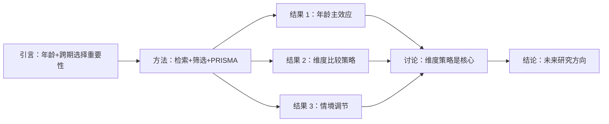

# Motivation Thread + Section Blueprints 模板（v5.21.0 新增）

> 来源：吸收 PaperSpine（WUBING2023/PaperSpine）的 motivation-driven 写作思路  
> 用途：synthesize 写综述/写章节前，先用本模板**确认章节主线动机** + 设计章节蓝图  
> 核心思想：**先学场景 → 再学样例 → 确认主线 → 设计章节蓝图 → 才动笔**

---

## 🎯 为什么需要这个模板？

传统综述写作的 3 个常见问题：
1. **章节松散**：每节各自写，章节间逻辑断裂
2. **主线不清**：写完不知道"读者读完这节应该带走什么 insight"
3. **重写成本高**：写完才发现论证不严密，返工成本大

**本模板解决**：写作前先把"为什么写这一节 / 写给谁 / 论证链是什么"想清楚。

---

## 📋 Part 1：motivation_thread_model.md（章节主线动机）

每个 synthesize 输出必须填：

```markdown
# Motivation Thread — <论文/综述标题>

## 一、全文主线（Controlling Motivation）

> 用一句话回答：本文/本综述**最想让读者相信什么**？

[填写示例：  
"现有跨期选择研究中，年龄差异主要通过认知控制中介，但 SS 偏好维度比较策略这一中介机制被忽视。本综述提出：维度比较策略是年龄与 SS 偏好关系的核心中介，且其效应受任务情境调节。"]

## 二、章节主线图（Mermaid）



## 三、每章的 motivation（微观）

| 章节 | 读者读完应带走 | 论证链 |
|------|---------------|--------|
| 引言 | 这个问题值得研究 | 现有研究缺口 → 本文填补 |
| 方法 | 结果可信 | PICO + 数据库 + 筛选标准 |
| 结果 1 | 年龄效应存在 | 效应量 + 异质性 + 偏倚 |
| 结果 2 | 维度策略是核心 | 中介分析 + 边界条件 |
| 讨论 | 综合理解 | 与既有理论对话 + 局限 |

---

## 📋 Part 2：section_blueprints.md（章节蓝图）

每个章节在动笔前先填：

### 章节：<X.X 章节标题>

#### 1. 写作目标（Writing Goal）
> 这一节**最终要让读者信什么**？

[填写]

#### 2. 论点清单（Claims）
- [ ] 论点 1：（一句话主张）
  - 支撑：来源 wiki source ID（zotero_item_key: ???）
  - 证据类型：实验 / 观察 / 综述 / 理论
- [ ] 论点 2：（一句话主张）
  - 支撑：来源 wiki source ID
  - 证据类型：...

#### 3. 段落级蓝图（Paragraph Blueprint）

| 段号 | 功能 | 长度 | 引用 |
|------|------|------|------|
| 1 | 引出本节问题（hook） | 50-80 字 | 1-2 |
| 2 | 现有研究不足 | 100-150 字 | 3-5 |
| 3 | 本文立场/发现 | 150-200 字 | 主引用 |
| 4 | 与既有理论对话 | 100-150 字 | 2-3 |
| 5 | 本节小结 + 桥接下节 | 50 字 | - |

#### 4. 图表蓝图（Figures/Tables）

| 表/图 | 类型 | 内容 | 出现位置 |
|-------|------|------|---------|
| Table 1 | 描述性 | 纳入研究基本特征 | 方法末尾 |
| Figure 1 | 流程图 | PRISMA | 方法中段 |
| Figure 2 | 森林图 | Meta 分析 | 结果中段 |

#### 5. 风险点（Risk Notes）
- [ ] 是否有 overclaim？（如把相关说成因果）
- [ ] 引用是否能支撑每个断言？
- [ ] 与既有理论是否对话？
- [ ] 是否留了 future direction 钩子？

---

## 📋 Part 3：rewrite_matrix.md（重写决策矩阵）

每次大改前先填：

| 原章节 | 改动类型 | 改动理由 | 风险 | 决策 |
|--------|---------|---------|------|------|
| 3.1 引言 | 全部重写 | motivation 不清 | 高 | ✅ 重写 |
| 3.2 方法 | 微调 | 补充检索范围 | 低 | ✅ 微调 |
| 3.3 结果 | 大改 | 加入 meta-analysis | 中 | ✅ 大改 |
| 3.4 讨论 | 删 1 段 | 与 3.1 重复 | 低 | ✅ 删 |

---

## 🛠️ 集成到 synthesize 工作流

| 阶段 | 用什么 |
|------|--------|
| 写作前 | `motivation_thread_model.md` + 全文章节表 |
| 每章动笔前 | `section_blueprints.md`（该章的 5 部分） |
| 改稿前 | `rewrite_matrix.md`（判断改/不改） |
| 终稿前 | 跑 `references/manuscript-audit-standards.md` |

---

## ⚠️ 边界条件

| 不要做 | 原因 |
|--------|------|
| ❌ 不要跳过 motivation 直接写 | 没主线的章节读者读不下去 |
| ❌ 不要把 motivation 写得很抽象 | 必须具体到"读者读完带走什么 insight" |
| ❌ 不要把 blueprint 写成大纲 | blueprint 是**论据链** + **段落功能**，不是目录 |
| ❌ 不要在改稿时直接 patch | 必须先填 rewrite_matrix 决策 |

---

## 📚 参考

- PaperSpine motivation-thread-writing.md
- 来源仓库：https://github.com/WUBING2023/PaperSpine
- 论文写作"主线驱动"方法论（Booth, Colomb, Williams 2008 *The Craft of Research*）

---

*最后更新：2026-06-22 v5.21.0*  
*来源借鉴：PaperSpine（WUBING2023/PaperSpine）*